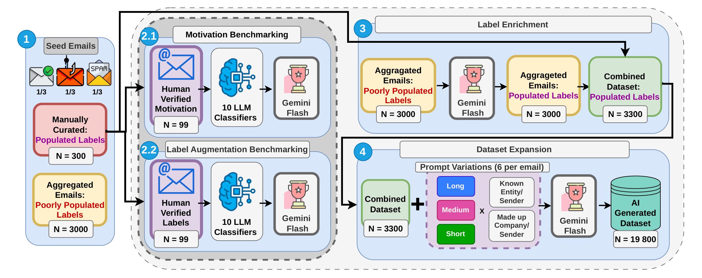
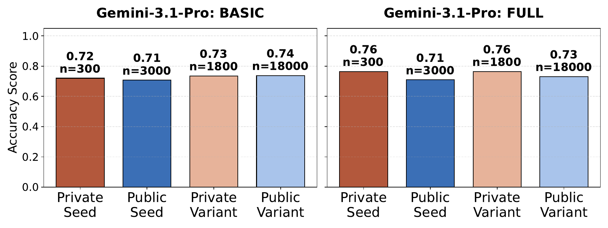
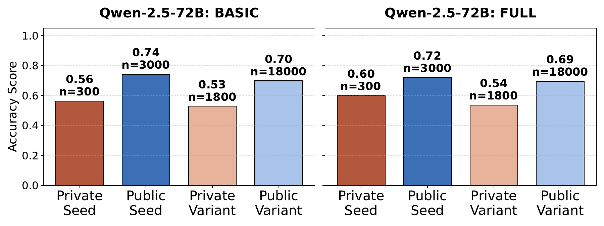
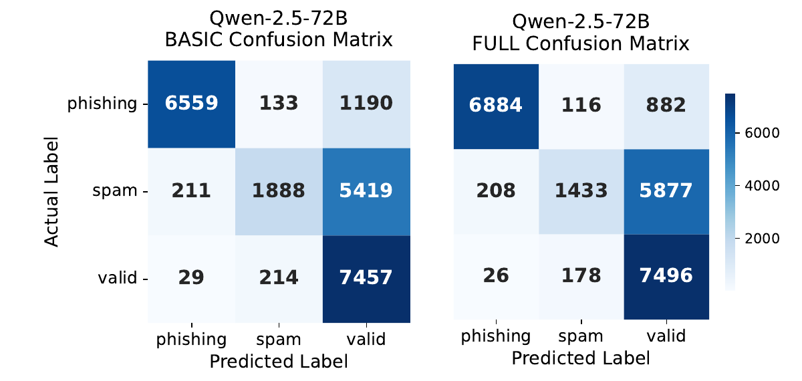
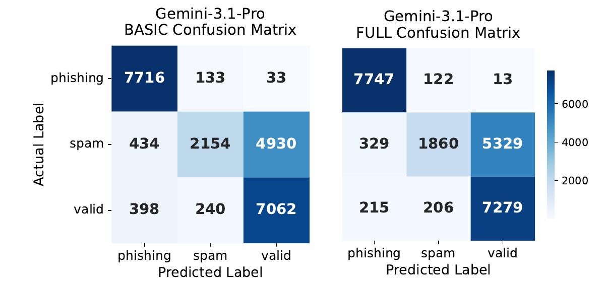
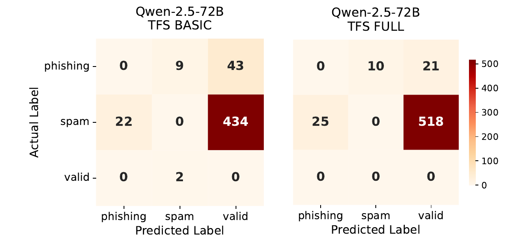
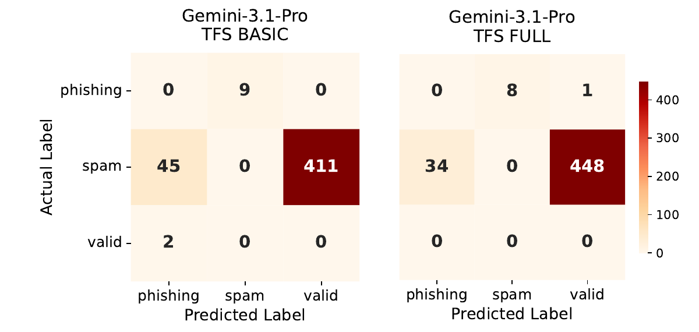

# The Machine Wars Email Dataset

  

## Overview

**Title:** The Phish, The Spam, and The Valid: Generating Feature-Rich Emails for Benchmarking LLMs

**Abstract:**

We introduce a metadata-enriched generation framework **PhishFuzzer** that seeds real emails into Large Language Models (LLMs) to produce 23,100 diverse, structurally consistent variants across controlled entity and length dimensions. Unlike prior corpora, our dataset features strict three-class labels (Phishing, Spam, Valid), preserves full URL and attachment metadata, and annotates each email with attacker motivation. Using this dataset, we benchmark state-of-the-art LLMs (Qwen-2.5 and Gemini-3.1-Pro) under both strict and relaxed classification configurations. By applying formal confidence metrics (Task Success Rate and Confidence Index), we analyze model reliability, robustness against linguistic fuzzing, and the impact of structural metadata on detection accuracy. Our fully open-source framework and dataset provide a rigorous foundation for evaluating next-generation email security systems.

------------------------------------------------------------------------

## Citation

If you use this dataset, please cite:

    [Placeholder for citation information]

------------------------------------------------------------------------

## Dataset Structure

`machinewars_emails_original_seed_v1.json`
    Final dataset of 3,300 emails used for experiments, benchmarking and seeded paraphrasing.
`machinewars_emails_entity_rephrased_v1.json`
    Final dataset of 19.800 emails of seeded paraphrasing. Each oroginal email received 6 variants can be tracked with the field "Original_ID"

### 1️⃣ Identity

-   `No.` -- Global unique ID
-   `Original_ID` -- Seed email ID

### 2️⃣ Content

-   `Subject` -- Email subject
-   `Body` -- Full message body
-   `Sender` -- Display name and email
-   `URL` -- List of URLs (if present)
-   `File` -- Attachment names (if present)

### 3️⃣ Classification

-   `Type` -- Phishing / Spam / Valid
-   `Motivation` -- Follow the link / Open attachment / Reply / Unknown

### 4️⃣ Provenance

-   `Created by` -- Human or LLM
-   `Source` -- Dataset origin (Manual for privately collected emails)
-   `Year` -- Email sent/created year

### 5️⃣ Experimental Controls

-   `Entity_Type` -- well_known / fabricated
-   `Length_Type` -- short / medium / long

------------------------------------------------------------------------

# Repository Structure

## Root
* `PhishFuzzer_emails_original_seed_v1.json`  
  Final dataset of **3,300 seed emails** used for experiments, benchmarking, and paraphrasing.
* `PhishFUzzer_emails_entity_rephrased_v1.json`  
  Final expanded dataset of **19,800 emails**. Each original email has 6 variants, trackable via the `Original_ID` field.

---

## 1. DataSet_Creation

### 1.1 Dataset Initial Stage
* `emails_base.json` — Initial curated dataset.
* `stats.py` — Script to calculate dataset statistics and ensure category balance.

### 1.2 Motivation Labeling
* `motivational_labeling.py` — LLM-based motivation annotation script.
* `emails_labeled_gemini.json` — The resulting labeled dataset.
* `Benchmark/` — Folder containing multi-model benchmarks.
  * `emails_labeled_benchmark.json` — A curated subset of 99 emails (33 phishing, 33 spam, 33 valid) with full metadata and expert-verified motivational labels.

### 1.3 Population (Metadata Completion)
* `populate_prompt.py` — Prompts used for metadata completion.
* `emails_populated_non_manual_gemini.json` — The populated dataset.
* `Benchmark/` — Multi-model population benchmark results.

### 1.4 Normalization
* `normalize.py` — Script for standardizing fields and schema.
* `emails_normalized.json` — The finalized, standardized dataset.

### 1.5 RePhrase (Expansion)
* `expand.py` — Script for entity-seeded variant generation.
* `prompts.py` — Collection of rephrasing prompts.
* `emails_expanded_2026_Gemini.json` — The expanded variant dataset.

---

## 2. Classification
Located in the `PhishFuzzer/Classification` directory:

### Core Scripts
* `classify_Gemini.py` — Execution script for Gemini model classification.
* `classify_Qwen.py` — Execution script for Qwen model classification.

### Results
* `Results/results_raw_gemini.jsonl` — Raw output from Gemini runs.
* `Results/results_raw_qwen.jsonl` — Raw output from Qwen runs.

### Analysis & Visualization
* `Analyze/aggregate_confusion_matrix.py` — Generates combined confusion matrices.
* `Analyze/private_public_original_rephrased.py` — Compares performance across data sources.
* `Analyze/template_reliability_metrics.py` — Calculates **TSR**, **Conf@K**, and **TFS** metrics.
* `Analyze/tfs_visual_matrices.py` — Visualizes Total Flip Scores.
* `Analyze/figures/` — Contains generated PDF reports (Confusion matrices, Provenance charts, and TFS comparisons) for both **Gemini 3.1 Pro** and **Qwen 2.5 72B**.

------------------------------------------------------------------------
# Methodology

  

## 1 Seed Dataset Creation
The dataset begins with **3,300 seed emails** originating from two complementary sources:

* **Private Collection (300):** Manually curated from anonymized personal and corporate submissions. Balanced across phishing, spam, and legitimate categories (100 each).
* **Public Aggregation (3,000):** Sourced from the **Kaggle Phishing Dataset** and **SpamAssassin corpus**. These emails use a coarser schema, requiring enrichment for structural granularity.

## 2 Motivation Benchmarking
To capture attacker intent, we benchmarked LLMs on identifying the **primary requested user action**. A subset of **99 emails** (33 per class) was labeled by experts using four categories:
* `Follow the link`
* `Open attachment`
* `Reply`
* `Unknown`

**Models Evaluated:** Claude 3.5 Sonnet, GPT-5.2-Chat, Gemini-2.5-Flash, Qwen-2.5-7B-Instruct, and DeepSeek-Chat ($k=5$, temperature = 0).

## 3 Label Enrichment
To fill missing structural metadata (URLs/filenames), we used LLMs to generate fields under **motivation-aligned constraints**:

| Motivation | Required Field |
| :--- | :--- |
| Follow the link | URL |
| Open attachment | Filename |

**Gemini-2.5-Flash** was selected based on structural correctness and manual plausibility review to enrich the 3,000 aggregated emails.

## 4 Dataset Expansion via Seeding
Each seed email serves as a **template**. We generated **six variants** per template ($K=7$ total emails per template) along two axes:

| Axis | Levels | Purpose |
| :--- | :--- | :--- |
| **Entity Type** | Real-world / Fabricated | Tests reliance on known brands |
| **Length Control** | Short, Medium, Long | Tests sensitivity to context length |

**Total Dataset Size:** 23,100 emails (3,300 seeds + 19,800 variants).

## 5 Evaluation Metrics
* **Strict Accuracy:** Standard three-class classification.
* **Template Success Rate (TSR):** Correct predictions across the $K$ variants of a single template.
* **Confidence Index (Conf@K):** Percentage of templates classified perfectly across all variants (TSR = K).
* **Total Flip Score (TFS@K):** Percentage of templates where the model fails all variants (TSR = 0).

## 6 Ethics & Anonymization
All emails underwent manual de-identification, content sanitization, and structured metadata validation to prevent data leakage. This research follows the ethics guidelines of the **University of Oslo**.

------------------------------------------------------------------------

# Results

## Motivation and Label Augmentation Benchmark

### Motivation Labeling

Metrics reported:

-   **Majority Accuracy** -- majority vote matches ground truth\
-   **Strict Accuracy** -- all 5 runs match ground truth\
-   **Consistency** -- agreement with the model's own majority vote

  Model                  Majority Acc.   Strict Acc.   Consistency
  ---------------------- --------------- ------------- -------------
  Claude 3.5 Sonnet      0.9394          0.9091        0.9838
  GPT‑5.2‑chat           0.9293          0.8788        0.9798
  **Gemini 2.5 Flash**   **0.9798**      **0.9798**    **1.0000**
  Qwen 2.5‑7B            0.7071          0.6162        0.9434
  DeepSeek Chat          0.8687          0.8586        0.9939

Gemini‑2.5‑Flash achieved the strongest performance, reaching **97.98%
strict accuracy** with perfect internal consistency.

---

## 2. Provenance Analysis
We analyzed if models overfit to public data versus our private collection.

| Gemini 3.1 Pro | Qwen 2.5 72B |
| :---: | :---: |
|  |  |
| **Uniform performance** across private and public subsets. | **Significant drop** in accuracy on private emails compared to public. |

**Key Takeaway:** Qwen shows signs of overfitting to public datasets, while Gemini maintains consistent accuracy across all sources.

---
## 3. Classification Performance
Aggregate metrics show a "Metadata Trade-off": metadata helps identify Phishing but makes Spam harder to distinguish from Valid mail.

### Confusion Matrices (Basic vs. Full Prompt)
| Model | Basic vs. Full Confusion |
| :--- | :---: |
| **Qwen 2.5 72B** |  |
| **Gemini 3.1 Pro** |  |

* **Phishing:** Gemini is "stricter," achieving an **F1 of 0.958** with metadata.
* **Spam:** Both models struggle with spam, often misclassifying it as Valid.

---

## 4. Reliability & Systematic Failures (TFS)
We tracked "Blind Spots"—templates where the model failed the seed and **all 6 variants**.

### Total Flip Score (TFS) Matrices
| Model | Systematic Failure Patterns |
| :--- | :---: |
| **Qwen 2.5 72B** |  |
| **Gemini 3.1 Pro** |  |

* **Phishing Blind Spots:** Qwen had 43 systematic failures (halved by metadata). Gemini had near zero.
* **Valid Emails:** Metadata **eliminated all systematic failures** for valid emails in both models.
* **Confidence:** Gemini is more consistent across rephrased variants, whereas Qwen is more likely to be "confidently wrong" across an entire template family.

---

## Classification Performance and Template Reliability Metrics

| Model | Prompt | Accuracy | Macro F1 | F1 (Phish) | F1 (Spam) | #Conf@7 | Conf@7 (%) | #TFS@7 | TFS@7 (%) |
| :--- | :--- | :--- | :--- | :--- | :--- | :--- | :--- | :--- | :--- |
| **Qwen-2.5-72B** | BASIC | 0.688 | 0.655 | 0.893 | 0.387 | 1,745 | 52.88% | 510 | 15.45% |
| **Qwen-2.5-72B** | FULL | 0.684 | 0.636 | 0.917 | 0.310 | 1,826 | 55.33% | 575 | 17.42% |
| **Gemini-3.1-Pro** | BASIC | 0.733 | **0.694** | 0.939 | **0.428** | 1,998 | 60.55% | **467** | **14.15%** |
| **Gemini-3.1-Pro** | FULL | **0.731** | 0.685 | **0.958** | 0.383 | **2,075** | **62.88%** | 491 | 14.88% |

